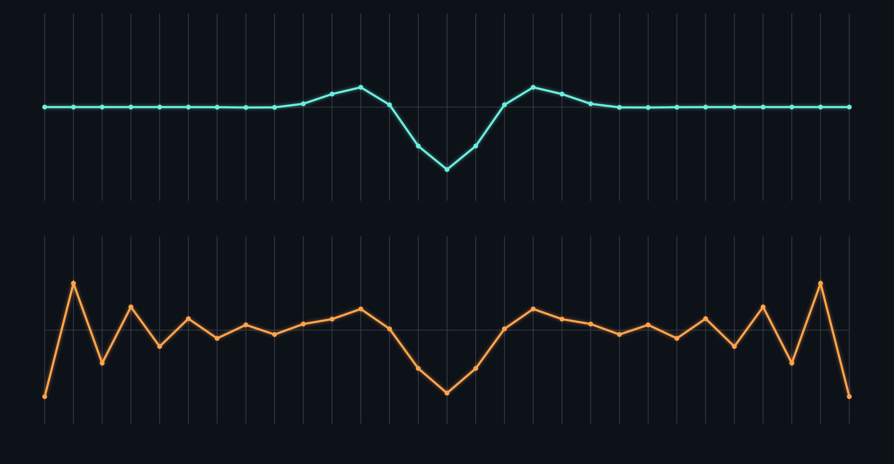

> **Abstract.** Maxwell's equations describe the electromagnetic field in terms of $\mathbf{E}$ and $\mathbf{B}$ without ever mentioning waves. A wave falls out of them anyway, moving at exactly $c = 1/\sqrt{\mu_0 \varepsilon_0}$. Seventy years later Schrödinger wrote a wave equation for matter, and the family resemblance turned out to be the beginning of a much longer argument.

## Four equations

In differential form the classical field is specified completely by four statements:

$$\nabla \cdot \mathbf{E} = \frac{\rho}{\varepsilon_0}$$

$$\nabla \cdot \mathbf{B} = 0$$

$$\nabla \times \mathbf{E} = -\frac{\partial \mathbf{B}}{\partial t}$$

$$\nabla \times \mathbf{B} = \mu_0 \mathbf{J} + \mu_0 \varepsilon_0 \frac{\partial \mathbf{E}}{\partial t}$$

Nothing there is a wave. The word does not appear. But take the curl of the third equation in free space, where $\rho = 0$ and $\mathbf{J} = 0$, then substitute the fourth:

$$\nabla \times \left( \nabla \times \mathbf{E} \right) = \nabla \left( \nabla \cdot \mathbf{E} \right) - \nabla^2 \mathbf{E} = -\frac{\partial}{\partial t} \left( \nabla \times \mathbf{B} \right) = -\mu_0 \varepsilon_0 \frac{\partial^2 \mathbf{E}}{\partial t^2}$$

The first term dies with the charge density, and what is left of the chain is a statement about one field alone:

$$\nabla^2 \mathbf{E} = \mu_0 \varepsilon_0 \frac{\partial^2 \mathbf{E}}{\partial t^2}$$

That is the wave equation, and its speed is pinned by two constants that were first measured in experiments with no light in them at all:

$$c = \frac{1}{\sqrt{\mu_0 \varepsilon_0}} \approx 2.998 \times 10^8 \ \mathrm{m\,s^{-1}}$$

## The plane-wave ansatz

Every solution can be assembled from exponentials. Writing $\Psi(x, t) = A e^{i(kx - \omega t)}$ and leaning on Euler's identity,

$$e^{i\theta} = \cos\theta + i\sin\theta$$

turns differentiation into multiplication: $\partial_t \to -i\omega$ and $\partial_x \to ik$. The wave equation collapses to a single algebraic constraint, the dispersion relation $\omega = ck$.

A general disturbance is then just a weighted sum of those exponentials, with the weights fixed once and for all by the shape it started as:

$$\Psi(x, t) = \frac{1}{\sqrt{2\pi}} \int_{-\infty}^{\infty} \tilde{A}(k) \, e^{i \left( kx - \omega(k) t \right)} \, dk, \qquad \tilde{A}(k) = \frac{1}{\sqrt{2\pi}} \int_{-\infty}^{\infty} \Psi(x, 0) \, e^{-ikx} \, dx$$

- **Wavenumber** — $k = 2\pi/\lambda$, the phase accumulated per metre
- **Angular frequency** — $\omega = 2\pi f$, the phase accumulated per second
- **Phase velocity** — $v_p = \omega/k$, which in vacuum is $c$ at every wavelength $\lambda$

The last point is the one worth pausing on. Vacuum is *non-dispersive*: ==every colour travels at the same speed==, which is why a distant supernova arrives as a flash rather than a smear.

## Matter waves

De Broglie proposed that a particle carrying momentum $p$ also carries a wavelength $\lambda = h/p$. Schrödinger asked what equation such a wave would have to satisfy:

$$i\hbar \frac{\partial}{\partial t} \Psi(\mathbf{r}, t) = \left( -\frac{\hbar^2}{2m} \nabla^2 + V(\mathbf{r}, t) \right) \Psi(\mathbf{r}, t)$$

It is first order in time rather than second, and the $i$ on the left is not bookkeeping — it is structural. The consequence is that $\Psi$ is irreducibly complex, so ==the amplitude itself is never measured==. Only its modulus is:

$$\int_{-\infty}^{\infty} \left| \Psi(x, t) \right|^2 dx = 1$$

Matter also pays a price vacuum does not. Expanding the dispersion relation about the centre of a packet,

$$\omega(k) = \omega_0 + \left. \frac{d\omega}{dk} \right|_{k_0} \! \left( k - k_0 \right) + \frac{1}{2} \left. \frac{d^2\omega}{dk^2} \right|_{k_0} \! \left( k - k_0 \right)^2 + \mathcal{O}\!\left( \left( k - k_0 \right)^3 \right)$$

the first derivative is the group velocity — the speed of the bump — and the second is why the bump does not keep its shape. For a free electron $\omega \propto k^2$, that second term never vanishes, and the packet spreads as it travels.

> A classical wave carries energy in proportion to amplitude squared. A quantum amplitude carries *probability* in proportion to modulus squared. The mathematics is nearly identical. The interpretation is not, and the whole of the twentieth century is in that gap.

### Where the analogy breaks

Superposition survives the crossing: sums of solutions remain solutions on both sides. What does not survive is the idea that the wave is made *of* something. An electromagnetic wave is a disturbance in a field that exists whether or not anyone measures it. $\Psi$ is a catalogue of amplitudes over configurations, and for $n$ particles it lives in $3n$ dimensions rather than three.

## Constants

| Symbol | Quantity | Value |
| --- | --- | --- |
| $c$ | Speed of light | $2.9979 \times 10^{8}$ |
| $h$ | Planck constant | $6.6261 \times 10^{-34}$ |
| $\hbar$ | Reduced Planck | $1.0546 \times 10^{-34}$ |
| $\varepsilon_0$ | Permittivity | $8.8542 \times 10^{-12}$ |
| $\mu_0$ | Permeability | $1.2566 \times 10^{-6}$ |

In SI units, reading down: metres per second, joule-seconds, joule-seconds again, farads per metre, and newtons per ampere squared. Since 2019 ==the first three are exact by definition== — the metre and the kilogram are now *derived* from them, rather than the other way round.

## A discrete wave

Numerically the whole thing is one loop. Sample the field on a grid, and the second derivative becomes a difference of neighbours:

```swift
func step(
    field: inout [Double],
    previous: [Double],
    courant: Double
) {
    let r2 = courant * courant
    for i in 1..<(field.count - 1) {
        let curve = field[i - 1]
            - 2 * field[i]
            + field[i + 1]
        field[i] = 2 * field[i]
            - previous[i] + r2 * curve
    }
}
```

Stability requires the Courant number $r = c \, \Delta t / \Delta x$ to satisfy $r \le 1$: ==no disturbance may cross more than one cell per step==. Push past it and the simulation does not merely lose accuracy, it diverges — the discrete grid enforcing its own speed limit, for much the same reason the continuous one does.



*Fig. 2 — The same pulse after four hundred steps at $r = 0.9$ and at $r = 1.05$. Identical code, one number apart.*

---

*Further reading: [A Dynamical Theory of the Electromagnetic Field](https://en.wikipedia.org/wiki/A_Dynamical_Theory_of_the_Electromagnetic_Field) (Maxwell, 1865) and [Quantisierung als Eigenwertproblem](https://en.wikipedia.org/wiki/Schr%C3%B6dinger_equation) (Schrödinger, 1926).*
