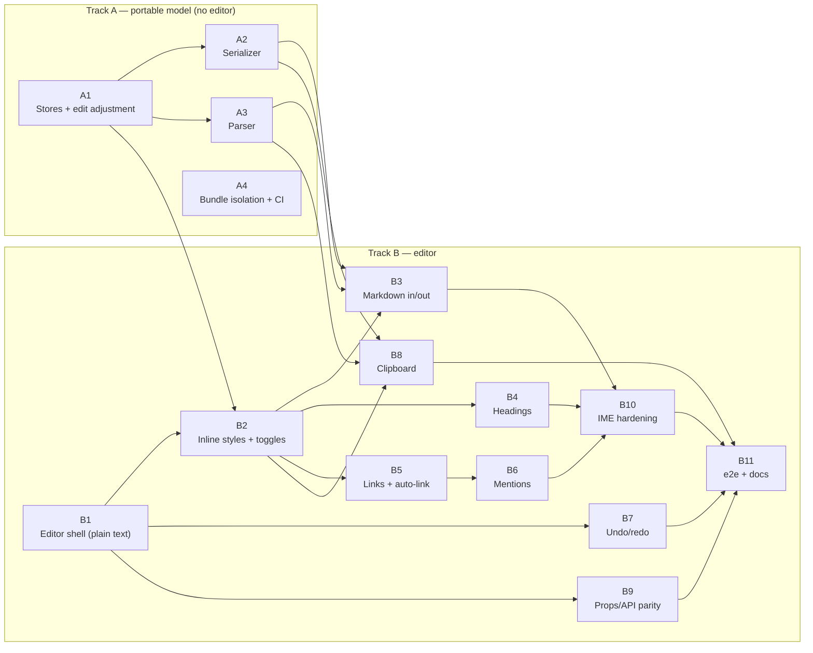

# EnrichedMarkdownTextInput — Web (DIY) Implementation Roadmap

Decision made: **hand-rolled contenteditable**, mirroring the native iOS model (plain-text buffer + parallel range stores +
serializer). This doc is the PR-by-PR plan.

## Target scope (native parity, verified against the iOS source)

The native input supports: **bold, italic, underline, strikethrough, spoiler** (inline),
**links** (incl. auto-link detection + `linkVariants`), **mentions**, **headings H1–H6**.
It does **not** support lists, code blocks, blockquotes, or tables — `toggleHeading` is the only
block toggle. Web v1 targets exactly this set; lists/code blocks/blockquote/inline code are
planned as [V2 cross-platform features](#v2--block-features-lists-code-blockquote).

Out of scope for web v1 (per research doc): native context/format menus (no-op),
markdown clipboard pasteboard type, `allowFontScaling`.

## Architecture (fixed decisions)

Mirrors iOS 1:1. Three held artifacts:

1. **Stores (source of truth)** — `FormattingStore` (sorted inline ranges, overlap allowed,
   same-type merge) + `BlockStore` (line-scoped, non-overlapping), both in **plain-text UTF-16
   offsets**. Direct port of `ENRMFormattingStore` / `ENRMBlockStore` / `ENRMAdjustRangeForEdit`,
   but ranges are **discriminated unions with per-type `attrs`** (ProseMirror naming), not
   native's flat nullable fields:

   ```ts
   type InlineRange =
     | {
         type: 'bold' | 'italic' | 'underline' | 'strikethrough' | 'spoiler';
         start: number;
         length: number;
       }
     | { type: 'link'; start: number; length: number; attrs: { url: string } };

   type BlockRange = {
     type: 'heading';
     start: number;
     length: number;
     attrs: { level: 1 | 2 | 3 | 4 | 5 | 6 };
   };
   // v2 adds e.g. { type: 'bulletList'; attrs: { indent: number } },
   //              { type: 'codeBlock'; attrs: { language?: string } } — see V2-0
   ```

   The union gives exhaustiveness checking in the behavior table / serializer / renderer;
   `attrs` stays an opaque bag to the generic range-shifting math.

2. **Plain-text buffer** — delimiter-free string (`bold`, not `**bold**`). `\n` per line.
3. **Rendered DOM** — derived. One `<div>` per line (empty line = `<div><br></div>`), styled
   `<span>`s inside, produced from buffer+stores. Never read back as truth.

Markdown is **not held** — `getMarkdown()`/`onChangeMarkdown` serialize on demand (port of
`ENRMMarkdownSerializer`); the parser (md4c-compatible) runs **only** on
`defaultValue`/`setValue`/paste, never on typing. Typing adjusts store ranges via offset math.

**Considered and rejected: two-dimensional (per-line) store.** Yes, an insert at position 0
shifts every range in the flat store — but that's one pass of integer additions (microseconds
at chat-sized content; the DOM render on the same keystroke costs orders of magnitude more, and
native ships this exact model). Per-line range storage would (a) fragment cross-line inline
ranges (multi-line selection + `toggleBold` spans `\n`) with re-join logic for serialization and
state queries, (b) trade the six flat overlap cases for structural split/merge/splice paths on
Enter / Backspace-at-line-start / multi-line paste — historically the buggiest part of editors,
(c) forfeit the direct `ENRMAdjustRangeForEdit` port + native golden-fixture parity, and
(d) still need a flat-offset mapping layer since the public API is flat offsets. The wins it
would target already exist: rendering is line-scoped via the edit range, and `BlockStore` is
line-scoped. The store is a module boundary (A1) — internals can be swapped later if profiling
ever disagrees. (True large-document scale would call for a rope/tree buffer, not per-line
ranges — out of scope.)

**Edit pipeline (the one hard constraint):** intercept `beforeinput`, `preventDefault()`, and
route _every_ mutation — typing, deletes, toggles, paste, mention insertion — through a single
`applyEdit(transaction)`:

```
beforeinput → build transaction {editRange, insertedText, source}
  → applyEdit:
      buffer update
      store.adjustForEdit (shift/clip/drop ranges)
      block normalization (prune orphaned headings, snap to line bounds)
      apply pending styles to insertion
      render dirty lines (line-scoped, like native's scoped formatting pass)
      restore selection from plain-text offsets
  → emit onChangeText / onChangeSelection / onChangeState / onChangeMarkdown
```

Why non-negotiable from PR 1:

- **Custom undo is mandatory, not polish** — `preventDefault()` on `beforeinput` permanently
  breaks the browser's native undo stack. History itself lands late (PR B7), but only because
  `applyEdit` is the single choke point it attaches to.
- **Composition guard from day 1** — `insertCompositionText` is not cancelable; during IME
  composition the browser owns DOM + selection (touching either breaks Gboard, which composes
  even for plain English). Pipeline carries an `isComposing` flag: during composition do nothing,
  on `compositionend` diff the composed line against the buffer and feed one transaction through
  `applyEdit`. The _skeleton_ is PR B1; Android hardening is PR B10.
- **Selection restore is core** — every re-render replaces text nodes the selection anchors to;
  serialize selection to plain-text offsets before, restore after (native's defensive
  save/restore). In PR B1. The deferrable cursor work is only boundary affinity (comes free with
  pending styles in B2) and IME edge cases (B10).

## PR breakdown

Two tracks. Track A is pure TypeScript logic — no DOM, no editor, unit-testable, fully
parallel to Track B1. Estimates assume one focused dev; S 1–2 tasks per day, M ≈ 1-2 days,
L up too week (3-5 days).

### Track A — portable model (no editor dependency)

| PR                                        | Contents                                                                                                                                                                                                                                                                                                                                                 | Size                                 | Depends on |
| ----------------------------------------- | -------------------------------------------------------------------------------------------------------------------------------------------------------------------------------------------------------------------------------------------------------------------------------------------------------------------------------------------------------- | ------------------------------------ | ---------- |
| **A1 — Stores + edit adjustment**         | TS port of `ENRMFormattingStore`, `ENRMBlockStore`, `ENRMAdjustRangeForEdit` (all overlap cases), same-type merge, `removeType:inRange:` fragmentation, atomic-link selection snapping helper, heading prune/normalize helpers. Exhaustive unit tests. Defines the shared types every other PR uses.                                                     | M                                    | —          |
| **A2 — Serializer**                       | TS port of `ENRMMarkdownSerializer`: paragraph-break splitting, whitespace-boundary trimming, nesting priority (Em→Strong→Underline→Strike→Spoiler→Link), closings-before-openings event sort, block line prefixes. **Golden-fixture parity tests: generate fixtures from the native serializer (iOS test target dumping JSON) and diff byte-for-byte.** | M                                    | A1 (types) |
| **A3 — Parser**                           | markdown → `{plainText, formattingRanges, blockRanges}` for `setValue`/paste. Extend the existing md4c WASM glue to expose source offsets (input dialect flags: underline, strikethrough, spoiler) + port the remend pass. Same golden-fixture technique against `ENRMInputParser`. Roundtrip property test: parse→serialize = identity on fixtures.     | M (risk: L if WASM glue fights back) | A1 (types) |
| **A4 — Bundle isolation + CI size check** | The builder-bob `lib/module/package.json` `sideEffects` patch from the research doc + bundle-size CI guard so renderer-only consumers never pay for the input. Mandatory regardless of everything else; fully independent.                                                                                                                               | S                                    | —          |

### Track B — the editor

| PR                                 | Contents                                                                                                                                                                                                                                                                                                                                                                                                                                                                                                                                                                                                                                                                                                            | Size | Depends on           |
| ---------------------------------- | ------------------------------------------------------------------------------------------------------------------------------------------------------------------------------------------------------------------------------------------------------------------------------------------------------------------------------------------------------------------------------------------------------------------------------------------------------------------------------------------------------------------------------------------------------------------------------------------------------------------------------------------------------------------------------------------------------------------- | ---- | -------------------- |
| **B1 — Editor shell (plain text)** | `src/web/EnrichedMarkdownTextInput.tsx` behind the shared `EnrichedMarkdownTextInputInstance` type. Contenteditable div, canonical DOM model (div-per-line), **`beforeinput` interception + `applyEdit` transaction pipeline**, DOM-position ↔ plain-text-offset mapping (both directions, cross-browser), selection save/restore, **composition guard skeleton** (`compositionstart`/`compositionend` reconcile). Props/events that don't need styles: `defaultValue` (plain text for now), `placeholder(TextColor)`, `editable`, `autoFocus`, `multiline` (Enter filter), `onChangeText`, `onChangeSelection`, `onFocus`/`onBlur`, `focus`/`blur`/`setSelection`. The riskiest PR — everything else stands on it. | L    | —                    |
| **B2 — Inline styles + toggles**   | Wire `FormattingStore` into render (styled spans, line-scoped dirty re-render), `markdownStyle` mapping for inline types, `toggleBold/Italic/Underline/Strikethrough/Spoiler` (selection → store range; collapsed cursor → **pending styles**, the `typingAttributes` analog incl. removals + boundary affinity), `onChangeState`.                                                                                                                                                                                                                                                                                                                                                                                  | M–L  | A1, B1               |
| **B3 — Markdown in/out**           | `defaultValue` as markdown, `setValue()`, `getMarkdown()`, `onChangeMarkdown` (only when prop set, matching native perf contract). Pure wiring of A2+A3 into B2's pipeline.                                                                                                                                                                                                                                                                                                                                                                                                                                                                                                                                         | S–M  | A2, A3, B2           |
| **B4 — Headings**                  | `BlockStore` in render (per-line h1–h6 styles from `markdownStyle`), `toggleHeading(level)`, Enter-in-heading (no auto-continuation, matching native), backspace-merge + orphaned-heading prune + line-bound normalization, empty-heading placeholder behavior (native #515), typing-attributes sync with cursor block.                                                                                                                                                                                                                                                                                                                                                                                             | M    | B2                   |
| **B5 — Links + auto-link**         | `setLink`/`insertLink`/`removeLink`, link rendering + `linkVariants`, **atomic selection snapping** (partial selection → whole link, caret-inside → end), atomic deletion, `linkRegex` auto-detection with transient ranges merged at serialization (native's detector pipeline), `onLinkDetected`.                                                                                                                                                                                                                                                                                                                                                                                                                 | M–L  | B2                   |
| **B6 — Mentions**                  | Mention session detection (`mentionIndicators`, `onStartMention`/`onChangeMention`/`onEndMention`), `startMention()`, `insertMention()` (replace active query with atomic link), atomic backspace. Mostly reuses B5's atomic-link machinery.                                                                                                                                                                                                                                                                                                                                                                                                                                                                        | M    | B5                   |
| **B7 — Undo/redo**                 | History stack attached to `applyEdit`: snapshots of {buffer, stores, selection}, edit grouping (typing bursts coalesce, toggles/paste are barriers), intercept `historyUndo`/`historyRedo` `beforeinput` + Cmd/Ctrl+Z/Shift+Z.                                                                                                                                                                                                                                                                                                                                                                                                                                                                                      | M    | B1 (better after B2) |
| **B8 — Clipboard**                 | Copy/cut emit serialized markdown + plain text; paste handles markdown (via A3 parser), plain text, and sanitized HTML→markdown; `copyToClipboard()` (decision from research doc: serialized markdown). Safari clipboard quirks.                                                                                                                                                                                                                                                                                                                                                                                                                                                                                    | M    | A2, A3, B2           |
| **B9 — Props/API parity sweep**    | `cursorColor`, `selectionColor` (CSS), `scrollEnabled`, `autoCapitalize`, `writingDirection`/RTL (per-line `dir=auto`), `getCaretRect()` + `onCaretRectChange`, menu props documented as no-ops. Independent of B4–B8; can land anytime after B1/B2.                                                                                                                                                                                                                                                                                                                                                                                                                                                                | M    | B1/B2                |
| **B10 — IME + browser hardening**  | The composition guard grows real reconciliation: Android Chrome + Gboard (autocorrect, swipe), iOS Safari, dead keys, spellcheck replacements, Firefox `getTargetRanges` fallback. Mostly testing + point fixes; testing-heavy calendar time.                                                                                                                                                                                                                                                                                                                                                                                                                                                                       | L    | B1–B6 landed         |
| **B11 — e2e + docs**               | Playwright suite mirroring the Maestro flows (event ordering, offset semantics incl. emoji/UTF-16, toggle-at-collapsed-cursor), cross-browser matrix in CI, `WEB.md` + README update, example app page. Start the harness earlier (with B2) and grow it per-PR; this PR is the completion gate.                                                                                                                                                                                                                                                                                                                                                                                                                     | L    | all                  |

### Dependency graph / parallelization

```
A1 ──► A2 ─┐
   └─► A3 ─┤
A4 (independent)
           │
B1 ──► B2 ─┼─► B3
       ├──► B4
       ├──► B5 ─► B6
       ├──► B7
       ├──► B8 (needs A2/A3)
       └──► B9
B10, B11 last
```



Entry points with no dependencies — **A1**, **A4**, **B1** — can all start in parallel as
non-stacked PRs. B11 additionally gates on everything (edges shown only from its direct
predecessors to keep the diagram readable).

### Cost summary

| Milestone                                                    | Time for 1 dev    |
| ------------------------------------------------------------ | ----------------- |
| Track A complete (model proven, byte-parity vs native)       | ~0.5 week         |
| B1+B2 (demoable WYSIWYG: type, toggle, styled render)        | ~1–1.5 weeks      |
| B3–B6 (full dialect: markdown IO, headings, links, mentions) | ~1.5–2 weeks      |
| B7–B9 (undo, clipboard, props parity)                        | ~1 week           |
| B10–B11 (IME hardening, e2e, docs)                           | ~1 week           |
| **Total**                                                    | **~1–1.5 months** |

## Corrections to the original sketch

- **No reparse-on-keystroke.** The buffer is delimiter-free, so styles are unrecoverable from it
  by parsing; and serialize→reparse per keystroke demands byte-perfect roundtripping to not lose
  data. Native's answer — offset-shift math on the store — is simpler and is what we port.
  "Raw markdown" is never held; it's derived on demand.
- **Three architectural items cannot be deferred** (all in B1): the single-transaction
  `applyEdit` pipeline (custom undo depends on it — `preventDefault` on `beforeinput` kills
  native undo), the composition-guard skeleton (retrofit = rewrite), and selection save/restore
  (without it the caret resets every keystroke). Everything else cursor-ish is genuinely
  deferrable: affinity ships with pending styles (B2), IME hardening ships last (B10).

## V2 — block features (lists, code, blockquote)

These are absent from the **native** input too, so each is a **cross-platform feature**
(iOS + Android + web + typed API), not web work — budget roughly 3× the web-only estimate
per feature, or ship web-first behind a flag and accept a temporary parity gap (product
decision, decide before V2-1). Sequenced easiest→hardest by how well each fits the existing
model.

**What v1 must keep generic so v2 needs no rewrite** (all cheap, all flagged in the v1 PRs):

- **A1**: `BlockStore` entries stay `{type, attrs}` — not heading-specific fields.
- **A2**: keep native's serializer _block-handler_ abstraction (prefix-per-line callback)
  instead of hardcoding `#` prefixes.
- **B4**: route Enter/Backspace-at-block-start through a per-block-type behavior table
  (headings: no continuation; lists will say: continue) — not heading `if`s.
- **B1's flat div-per-line DOM model is kept** for v2: list items render as flat lines with
  CSS indentation + marker spans (matching how native renders lists via `NSParagraphStyle`
  indentation), not semantic `<ul>/<li>` nesting. No DOM-model change needed.

Known architectural cost, isolated to one feature: the native serializer asserts a
**line-count invariant** (plain-text lines == markdown lines, `ENRMMarkdownSerializer.mm:245`)
— per-line prefixes (`- `, `> `, `1. `) respect it; **fenced code blocks break it** (``` lines
have no plain-text counterpart). V2-5 relaxes the invariant on all platforms; nothing in v1
needs to anticipate it beyond keeping the handler abstraction.

| PR                                    | Contents                                                                                                                                                                                                                                                                                                               | Web size | Notes                              |
| ------------------------------------- | ---------------------------------------------------------------------------------------------------------------------------------------------------------------------------------------------------------------------------------------------------------------------------------------------------------------------- | -------- | ---------------------------------- |
| **V2-0 — Block model generalization** | Multi-attr blocks (indent level, ordered index, checked), the Enter/Backspace/Tab behavior table, serializer/parser handler wiring for new types, new API surface typed across platforms (`toggleBulletList`, `toggleOrderedList`, `toggleTaskList`, `toggleBlockquote`, `toggleCodeBlock`, extended `onChangeState`). | M        | Foundation; native ports mirror it |
| **V2-1 — Blockquote**                 | `> ` prefix per line, nesting via level, Enter continues quote, Backspace-at-start outdents. Simplest block — fits the prefix model exactly.                                                                                                                                                                           | S–M      |                                    |
| **V2-2 — Unordered lists**            | Marker rendering, Enter continues item / empty item exits list, Tab / Shift-Tab indent-outdent, merge rules on delete.                                                                                                                                                                                                 | M        |                                    |
| **V2-3 — Ordered lists**              | V2-2 plus number recomputation on insert/delete/reorder of items.                                                                                                                                                                                                                                                      | S–M      | Stacked on V2-2                    |
| **V2-4 — Task lists**                 | Checkbox as an atomic non-text inline widget (`contenteditable=false`), tap-to-toggle, `[ ]`/`[x]` serialization, checked-change event. First non-text widget in the input — new ground beyond mentions.                                                                                                               | M        |                                    |
| **V2-5 — Code blocks**                | Depending on what is the state of code block - if we will have codeblocks with code formatting this will be more expensive, if plain string should be relatively easy                                                                                                                                                  | L        | Serializer change on all platforms |
| **V2-6 — Inline code**                | `` `code` `` — not in the native input dialect today either, but it's an _inline_ style: fits `FormattingStore` as a new type with a "no other styles nest inside" rule + serializer priority slot. Can land any time after V2-0, independent of blocks.                                                               | S–M      | Cheapest v2 win                    |

Suggested v2 order: V2-0 → V2-6 (quick win) → V2-1 → V2-2 → V2-3 → V2-4 → V2-5.
Web-only wall-clock ≈ 4–5 weeks; with native parity implementations, a quarter-scale project.

## Open decisions (carry from research doc, decide in the marked PR)

- `copyToClipboard()` payload on web: recommend serialized markdown (decide in **B8**).
- Keyboard shortcuts (Cmd+B…): additive API; propose default keymap in **B2**, flag-gated.
- Offset unit contract: UTF-16 code units everywhere (JS native; matches NSString) — assert with
  emoji tests in **B11**.
